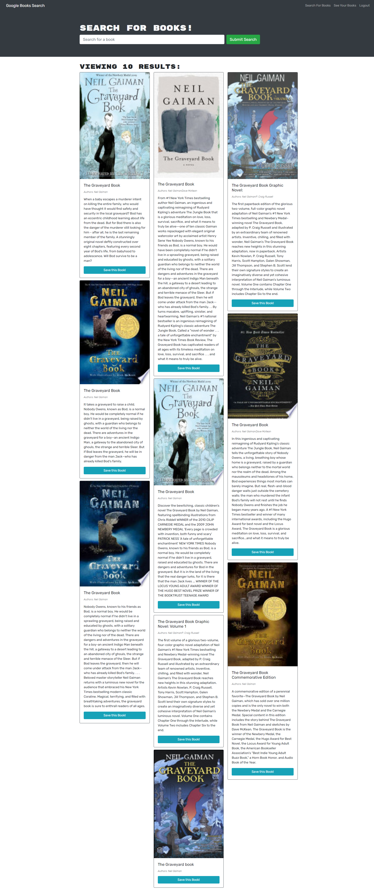

# Book Search

## Description

Book Search provides a search function for books and the ability to save books while logged in. This repository contains an updated version of Book Search that has been refactored to use a GraphQL API built with Apollo Server, in the place of the RESTful API that was in place previously.

The original code can be found in the following repository:

[Book Search Engine Starter Code](https://github.com/coding-boot-camp/solid-broccoli)

## Links

[Code repository](https://github.com/wgrout87/book-search)

[Deployed website](https://evening-river-75441.herokuapp.com/)

## Table of Contents

- [Usage](#usage)
- [License](#license)

## Usage

Any user visiting the site can search for books, but additional functionality is provided to those who wish to save books to their account. While logged in, a button will display for any search results to "Save this Book!". Clicking this button will save the book to the user's account, and from there on, the button will display a message if the user has already saved a book that come up in their search results. The user can also view a list of all the books they have saved by clicking the "See Your Books" option in the nav bar. While viewing saved books, the user will also be presented with the option to delete any books from their list.

## License

Copyright 2022 William Grout

Permission is hereby granted, free of charge, to any person obtaining a copy of this software and associated documentation files (the "Software"), to deal in the Software without restriction, including without limitation the rights to use, copy, modify, merge, publish, distribute, sublicense, and/or sell copies of the Software, and to permit persons to whom the Software is furnished to do so, subject to the following conditions:

The above copyright notice and this permission notice shall be included in all copies or substantial portions of the Software.

THE SOFTWARE IS PROVIDED "AS IS", WITHOUT WARRANTY OF ANY KIND, EXPRESS OR IMPLIED, INCLUDING BUT NOT LIMITED TO THE WARRANTIES OF MERCHANTABILITY, FITNESS FOR A PARTICULAR PURPOSE AND NONINFRINGEMENT. IN NO EVENT SHALL THE AUTHORS OR COPYRIGHT HOLDERS BE LIABLE FOR ANY CLAIM, DAMAGES OR OTHER LIABILITY, WHETHER IN AN ACTION OF CONTRACT, TORT OR OTHERWISE, ARISING FROM, OUT OF OR IN CONNECTION WITH THE SOFTWARE OR THE USE OR OTHER DEALINGS IN THE SOFTWARE.

[https://opensource.org/licenses/MIT](https://opensource.org/licenses/MIT)
